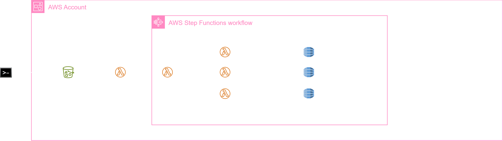
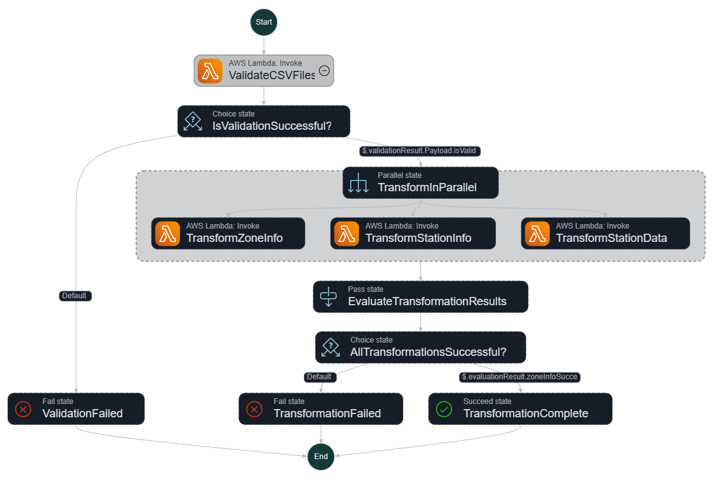

# EV Station Locator

AWS CDK infrastructure project for building a real-time EV charging station recommendation system using zone-level aggregated data from Hong Kong and Shenzhen.

## Table of Contents

- [Project Overview](#project-overview)
- [Key Features](#key-features)
- [Dataset Information](#dataset-information)
- [Architecture](#architecture)
- [DynamoDB Schema](#dynamodb-schema)
- [Step Functions Workflow](#step-functions-workflow)
- [Prerequisites](#prerequisites)
- [Installation](#installation)
- [Deployment](#deployment)
- [Data Upload](#data-upload)
- [Cost Analysis](#cost-analysis)
- [Project Structure](#project-structure)

---

## Project Overview

This project implements an **event-driven serverless data pipeline** that:

1. **Validates** uploaded CSV files for data integrity
2. **Transforms** zone and station information with geohash encoding
3. **Loads** charging metrics at the **zone level** for optimized storage
4. **Enables** real-time recommendations based on location, availability, and pricing

### Use Case

```
Given a user's GPS coordinates:
├─ Find nearby charging zones using geohash proximity
├─ Retrieve current charging metrics (occupancy, price, duration)
├─ Recommend the best zone based on weighted scoring
└─ Return available stations within that zone
```

---

## Key Features

✅ **Serverless Architecture** - Auto-scaling with Lambda and DynamoDB  
✅ **Geospatial Indexing** - 7-character geohash for ~150m precision  
✅ **Zone-Level Storage** - 97% data reduction vs station-level duplication  
✅ **AWS Free Tier Compliant** - $0.00/month with PROVISIONED billing  
✅ **Event-Driven Processing** - S3 uploads auto-trigger workflows  
✅ **Parallel Transformation** - Processes 4 metrics concurrently  
✅ **Combined Metrics** - Merges `e_price + s_price` into `total_price`

---

## Dataset Information

### Source

**UrbanEV**: Electric vehicle charging sessions dataset for Hong Kong & Shenzhen

- **Publication**: *Scientific Data* (2025)
- **Authors**: Wang et al., Shanghai Jiao Tong University
- **DOI**: [10.1038/s41597-024-04176-6](https://doi.org/10.1038/s41597-024-04176-6)
- **Repository**: [Dryad Digital Repository](https://datadryad.org/stash/dataset/doi:10.5061/dryad.gqnk98swb)
- **License**: Creative Commons CC0 1.0 Universal

### Dataset Characteristics

| Attribute | Value |
|-----------|-------|
| **Region** | Hong Kong & Shenzhen |
| **Time Period** | September 2022 - February 2023 (6 months) |
| **Zones** | 275 Traffic Analysis Zones (TAZIDs) |
| **Stations** | 1,362 charging stations (after filtering) |
| **Timestamps** | 27,000 hourly observations |
| **Metrics** | 4 combined charging metrics |

### Data Files

```
zone-information.csv           (275 zones with geospatial boundaries)
station_information.csv        (1,362 stations with lat/lon)
charge_1hour/duration.csv      (average charging time in minutes)
charge_1hour/e_price.csv       (electricity price in CNY/kWh)
charge_1hour/s_price.csv       (service fee in CNY/kWh)
charge_1hour/occupancy.csv     (number of busy charging piles)
charge_1hour/volume-11kw.csv   (realistic charging volume in MWh)
```

**Note**: `e_price` and `s_price` are combined into `total_price` during transformation (4 final metrics).

---

## Architecture

### AWS Services

- **S3**: CSV file storage with versioning and encryption
- **DynamoDB**: 3 tables (Zone_Information, Station_Information, Station_Data) with PROVISIONED billing
- **Lambda**: 5 functions (Validation, 3× Transformation, Trigger)
- **Step Functions**: Orchestrates validation and transformation workflow
- **CloudWatch**: Logging and monitoring

### Zone-Level Storage Decision

#### Why Zone-Level?

The UrbanEV dataset provides **zone-level aggregates**, not individual station readings. Storing at zone level:

- ✅ **Preserves data accuracy** (no false station-level precision)
- ✅ **Reduces storage** from 266M to 7.4M records (97% reduction)
- ✅ **Fits Lambda timeout** (~9 min vs 15+ hours)
- ✅ **Costs $0/month** vs $6.60/month

#### Query Pattern

```
User Location → Find Zone → Get Zone Metrics → Query Stations in Zone → Return Recommendations
```

---

## DynamoDB Schema

### Zone_Information Table

```
PK: ZoneId (STRING) - Format: "ZONE#102"

Attributes:
  - TAZID (NUMBER)
  - Centroid_Latitude (NUMBER)
  - Centroid_Longitude (NUMBER)
  - Geohash (STRING) - 7-character precision
  - Area (NUMBER)
  - Perimeter (NUMBER)
  - ChargeCount (NUMBER)

GSI: GeohashIndex
  PK: Geohash (STRING)
  Purpose: Proximity search for nearby zones
```

### Station_Information Table

```
PK: Station_Id (NUMBER)

Attributes:
  - Latitude (NUMBER)
  - Longitude (NUMBER)
  - Geohash (STRING) - 7-character precision
  - SlowCount (NUMBER)
  - FastCount (NUMBER)
  - TotalChargers (NUMBER)
  - TAZID (NUMBER)

GSI 1: GeohashIndex
  PK: Geohash (STRING)
  Purpose: Find stations within proximity

GSI 2: TazidIndex
  PK: TAZID (NUMBER)
  Purpose: Query all stations in a traffic zone
```

### Station_Data Table

```
PK: ZoneId (STRING) - Format: "ZONE#102"
SK: Timestamp (STRING) - ISO 8601 format

Attributes:
  - TAZID (NUMBER)
  - duration (NUMBER) - Average charging duration
  - total_price (NUMBER) - Combined e_price + s_price
  - occupancy (NUMBER) - Number of busy piles
  - volume_11kw (NUMBER) - Realistic charging volume
```

---

## Step Functions Workflow

### Workflow Diagram

The following diagram illustrates the complete ETL pipeline workflow:



*Figure: Step Functions state machine orchestrating CSV validation and parallel data transformation*

### AWS Console Graph View

The actual Step Functions state machine as shown in the AWS Console:



*Figure: Step Functions execution graph from AWS Console showing all states and transitions*

### Lambda Functions

| Function | Purpose | Timeout | Memory |
|----------|---------|---------|--------|
| **validate-csv** | Validate 7 CSV files, build TAZID mapping | 5 min | 1024 MB |
| **transform-zone-info** | Calculate zone centroids & geohash | 5 min | 1024 MB |
| **transform-station-info** | Calculate station geohash | 10 min | 2048 MB |
| **transform-station-data** | Combine 5 metrics into 4, write zone data | 15 min | 3008 MB |
| **trigger-stepfunction** | Parse manifest, trigger Step Functions | 1 min | 128 MB |

---

## Prerequisites

- **AWS Account** with CLI configured
- **Node.js** 18.x or later
- **AWS CDK** 2.x (`npm install -g aws-cdk`)
- **Git** for cloning the repository

---

## Installation

```bash
# Clone the repository
git clone https://github.com/puneetjoshi58/EVStationLocator.git
cd EVStationLocator

# Install dependencies
npm install

# Bootstrap CDK (first time only)
cdk bootstrap
```

---

## Deployment

```bash
# Synthesize CloudFormation template
cdk synth

# Deploy the stack
cdk deploy

# Note the outputs:
# EvStationLocatorStack.BucketName = evstationlocatorstack-evstationbucketcd730d2e-xxxxx
```

---

## Data Upload

### Using the Upload Script

The `upload-to-s3.js` script automatically fetches the bucket name from CloudFormation:

```bash
# Upload all CSV files and create manifest
node upload-to-s3.js
```

**What it does:**
1. Fetches bucket name from CloudFormation stack outputs
2. Uploads 7 CSV files to S3
3. Creates and uploads `_manifest.json`
4. Automatically triggers Step Functions workflow

### Manual Upload

```bash
# Get bucket name
aws cloudformation describe-stacks \
  --stack-name EvStationLocatorStack \
  --query "Stacks[0].Outputs[?OutputKey=='BucketName'].OutputValue" \
  --output text

# Upload files
aws s3 sync ./data/ s3://YOUR-BUCKET-NAME/urban-ev-data/
```

---

## Cost Analysis

### AWS Free Tier (Current Configuration)

| Service | Usage | Free Tier | Cost |
|---------|-------|-----------|------|
| **DynamoDB** | 3 tables, PROVISIONED (21/23 RCU/WCU) | 25 RCU / 25 WCU | $0.00 |
| **Lambda** | ~1 execution/upload | 1M requests/month | $0.00 |
| **Step Functions** | ~1 execution/upload | 4,000 state transitions | $0.00 |
| **S3** | ~70 MB storage | 5 GB | $0.00 |
| **CloudWatch Logs** | Minimal logging | 5 GB ingestion | $0.00 |
| **Total** | | | **$0.00/month** |

### If Exceeding Free Tier

Switching to PAY_PER_REQUEST billing:
- **DynamoDB**: ~$0.50/month for occasional queries
- **Other services**: Negligible costs

---

## Project Structure

```
EvStationLocator/
├── bin/
│   └── ev_station_locator.js       # CDK app entry point
├── lib/
│   ├── ev_station_locator-stack.js # Main infrastructure stack
│   ├── iam/
│   │   └── permissions.js          # IAM permission grants
│   └── workflows/
│       └── DataIngestionStepFunction.js # Step Functions definition
├── lambda/
│   ├── validate-csv/               # CSV validation Lambda
│   ├── transform-zone-info/        # Zone transformation Lambda
│   ├── transform-station-info/     # Station transformation Lambda
│   ├── transform-station-data/     # Metrics transformation Lambda (combined)
│   └── trigger-stepfunction/       # S3 event trigger Lambda
├── upload-to-s3.js                 # Data upload script
├── cdk.json                        # CDK configuration
└── package.json                    # Node.js dependencies
```

---

## Development

### Useful Commands

```bash
# List all stacks
cdk list

# Compare deployed vs local
cdk diff

# Destroy the stack
cdk destroy

# View CloudWatch logs
aws logs tail /aws/lambda/FUNCTION_NAME --follow --region ap-south-1

# Check Step Functions execution
aws stepfunctions list-executions \
  --state-machine-arn <STATE_MACHINE_ARN> \
  --region ap-south-1
```

### Testing

```bash
# Run CDK tests
npm test

# Validate stack compiles
cdk synth
```

---

## Troubleshooting

### Stack Deployment Fails

**Issue**: DynamoDB tables already exist  
**Solution**: Delete orphaned tables manually
```bash
aws dynamodb delete-table --table-name Zone_Information --region ap-south-1
aws dynamodb delete-table --table-name Station_Information --region ap-south-1
aws dynamodb delete-table --table-name Station_Data --region ap-south-1
```

### Upload Script Can't Find Bucket

**Issue**: CloudFormation stack not deployed  
**Solution**: Deploy stack first
```bash
cdk deploy
```

### Lambda Timeout

**Issue**: Processing too much data  
**Solution**: Reduce `MAX_ROWS` in `transform-station-data/index.js`

---

## References

- [UrbanEV Dataset Paper](https://doi.org/10.1038/s41597-024-04176-6)
- [AWS CDK Documentation](https://docs.aws.amazon.com/cdk/)
- [DynamoDB Best Practices](https://docs.aws.amazon.com/amazondynamodb/latest/developerguide/best-practices.html)
- [Geohash Algorithm](http://geohash.org/)

---

## License

This project uses the UrbanEV dataset under Creative Commons CC0 1.0 Universal license.

## Author

Puneet Joshi  
GitHub: [@puneetjoshi58](https://github.com/puneetjoshi58)
